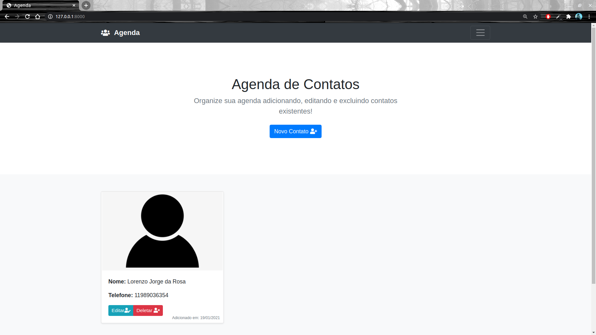
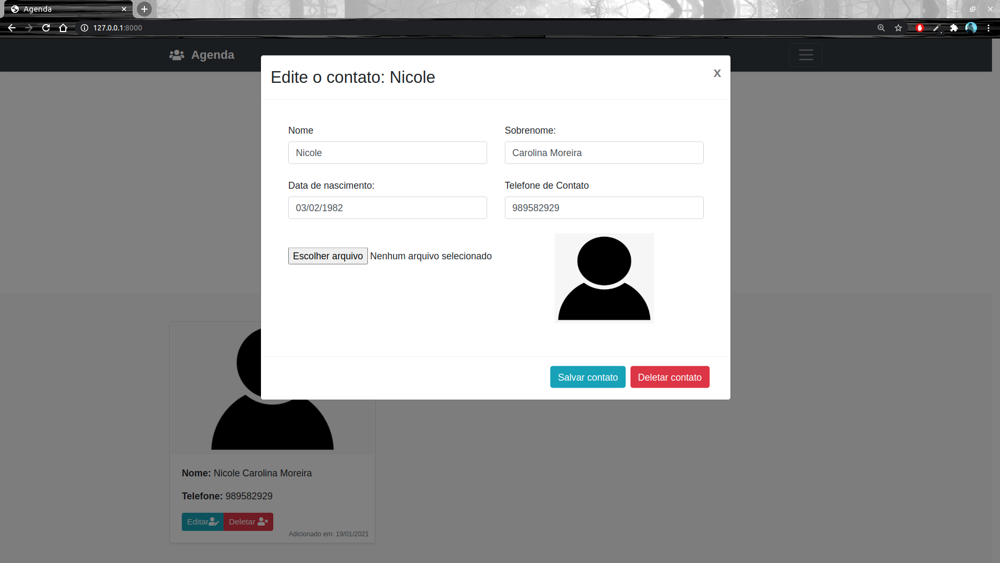
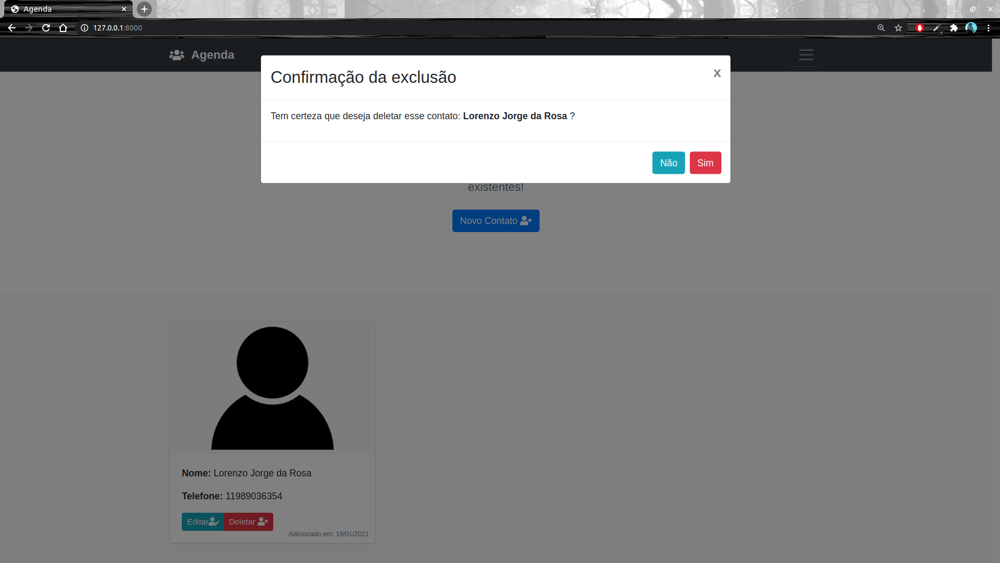

# Agenda de Contatos
Projeto em Django, utilizando ajax e javascript para efeito visual com modals para adicionar,
editar e deletar contatos do sistema:

Crud de agenda de contatos para organizar e salvá-los de acordo com a necessidade

- Tela inicial:

- Modal de adição de contato:

- Modal de Edição de contato existente:

  
- Confirmação de exclusão de contato:
